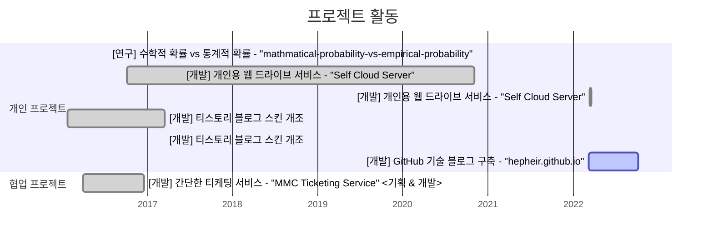

<!--
Gantt diagram syntax:

    TASK
        <task name> : [state,] [id,] <start-date>, <end-date>

    <task name> 작성 컨벤션
        <프로젝트 분류> <프로젝트 요약> - <프로젝트 명> <맡은 역할>

        - 프로젝트 분류 : 개발 | 대회 | 연구 | ...
        (ex. [개발] 개인용 웹 드라이브 서비스 - "Self Cloud Server" <기획 & 개발>)

-->

---

## Education

-   2017 보정고등학교 졸업
-   2018 동국대학교(경주캠퍼스) 전자정보통신공학 입학
-   2018 동국대학교(경주캠퍼스) EICE Lab. 소속 학부연구생
-   2023 상명대학교 지능IOT융합전공 편입학
-   2023 멋쟁이사자처럼Univ. 11기 백엔드(Django) 입부

## Certification

-   2023 "SAMSUNG ELECTRONICS 상시 SW 역량테스트" Level B 취득 ([SWEA](https://swexpertacademy.com/main/talk/solvingClub/clubView.do?solveclubId=AYWjN5DaiAsDFAQK) Username: Hepheir)

---

## 대외 활동

| (연도) 활동명                     | 소개                                                  | 참여             | 기술                                                |
| --------------------------------- | ----------------------------------------------------- | ---------------- | --------------------------------------------------- |
| (2016) MMC Ticketing Service      | 고교 연극동아리의 티켓팅 서비스                       | Web FE+BE        | ![php] ![node.js]                                   |
| (2017) Self Cloud Server          | 셀프 호스팅을 위한 웹 드라이브                        | Web FE+BE+Design | ![node.js]                                          |
| (2019) 제17회 임베디드SW 경진대회 | [지능형 휴머노이드]부문 본선진출[^team]               | Computer Vision  | ![python] ![opencv] #Threading #Serial              |
| (2020) 문화센터 다모여, 문다      | Moonda.kr 의 관리자 페이지 개발                       | Web FE           | ![react.js]                                         |
| (2021) BOJ Offline Judge          | 오프라인 Problem Solving 채점기                       | BE               | ![python]                                           |
| (2022) Jekyll N Hyde              | Jekyll 사용자를 위한 Visual Studio Code 확장 프로그램 | BE               | ![typescript] ![visual-studio-code] ![github-pages] |
| (2023) SMU Calender               | 상명대학교 학생을 위한 구독캘린더                     | BE               | ![python]                                           |

[^team]: 팀명: 공돌이들 / 동국대학교

---

## 연구 활동

### 참여 과제

| (과제고유번호) 과제명                                                                       | 과제수행기관         | 참여기간                |
| :------------------------------------------------------------------------------------------ | -------------------- | ----------------------- |
| (1425132456) 3D 스캔 기반 유물 도면화 S/W                                                   | 캐럿펀트             | 2019-01-01 ~ 2019-11-30 |
| (1711116255) (지능정보-3세부) 사용자의 의도와 맥락을 이해하는 지능형 인터랙션 기술 연구개발 | 경북대학교산학협력단 | 2020-03-01 ~ 2020-12-31 |

### 참여 논문

-   고배 유물 도면 자동 생성 모델의 투창 영역 윤곽선 검출 개선 2019, [riss.kr](http://www.riss.kr/search/detail/DetailView.do?p_mat_type=1a0202e37d52c72d&control_no=3095fa2e4ad9a57be9810257f7042666&keyword=유물%20도면%20생성)
-   유물 도면 생성 자동화 영상처리 S/W 개발 2019, [riss.kr](http://www.riss.kr/search/detail/DetailView.do?p_mat_type=1a0202e37d52c72d&control_no=8e583680cbd4df477ecd42904f0c5d65&keyword=유물%20도면%20생성)

<!-- https://github.com/Ileriayo/markdown-badges#markdown-badges -->

[express.js]: https://img.shields.io/badge/express.js-%23404d59.svg?style=flat-square&logo=express&logoColor=%2361DAFB
[flask]: https://img.shields.io/badge/flask-%23000.svg?style=flat-square&logo=flask&logoColor=white
[node.js]: https://img.shields.io/badge/node.js-6DA55F?style=flat-square&logo=node.js&logoColor=white
[react.js]: https://img.shields.io/badge/react-%2320232a.svg?style=flat-square&logo=react&logoColor=%2361DAFB
[javascript]: https://img.shields.io/badge/javascript-%23323330.svg?style=flat-square&logo=javascript&logoColor=%23F7DF1E
[java]: https://img.shields.io/badge/java-%23ED8B00.svg?style=flat-square&logo=java&logoColor=white
[php]: https://img.shields.io/badge/php-%23777BB4.svg?style=flat-square&logo=php&logoColor=white
[python]: https://img.shields.io/badge/python-3670A0?style=flat-square&logo=python&logoColor=ffdd54
[typescript]: https://img.shields.io/badge/typescript-%23007ACC.svg?style=flat-square&logo=typescript&logoColor=white
[opencv]: https://img.shields.io/badge/opencv-%23white.svg?style=flat-square&logo=opencv&logoColor=white
[visual-studio-code]: https://img.shields.io/badge/Visual%20Studio%20Code-0078d7.svg?style=flat-square&logo=visual-studio-code&logoColor=white
[github-pages]: https://img.shields.io/badge/github%20pages-121013?style=flat-square&logo=github&logoColor=white
