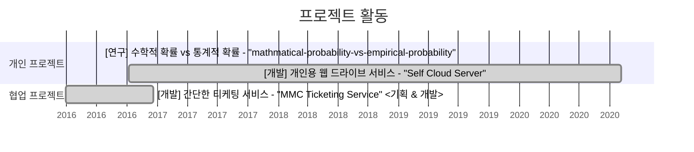

<!--
Gantt diagram syntax:

    TASK
        <task name> : [state,] [id,] <start-date>, <end-date>

    <task name> 작성 컨벤션
        <프로젝트 분류> <프로젝트 요약> - <프로젝트 명> <맡은 역할>

        - 프로젝트 분류 : 개발 | 대회 | 연구 | ...
        (ex. [개발] 개인용 웹 드라이브 서비스 - "Self Cloud Server" <기획 & 개발>)
-->

